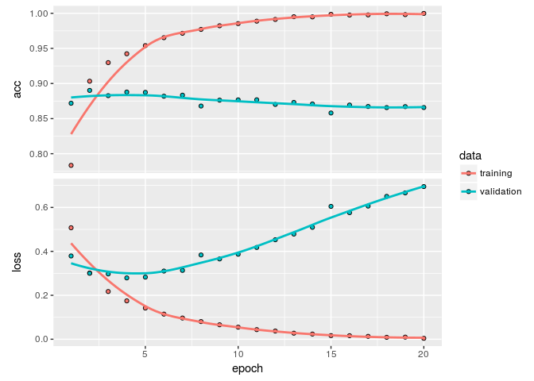

The imdb dataset
----------------

The dataset consists of 50000 highly polarized reviews from the Internet
Movie Database. The dataset is split into 25000 training and 25000
testing sets with 50% positive and 50% negative reviews in each. The
dataset is already preprocessed i.e., the reviews have been turned into
a sequence of integers, where each integer represents a specific word.

We will only deal with the 10000 most frequent words in the dataset to
keep the computation simpler.

    library(keras)

    imdb = dataset_imdb(num_words = 10000)
    c(c(train_data, train_labels), c(test_data, test_labels)) %<-% imdb

    ## Decoding word indexes
    word_index <- dataset_imdb_word_index()
    reverse_word_index <- names(word_index)
    names(reverse_word_index) <- word_index

    decoded_review <- sapply(train_data[[1]], function(index) {
      word <- if (index >= 3) reverse_word_index[[as.character(index - 3)]]
      if (!is.null(word)) word else "?"
    })

Encoding integer sequences as a binary matrix.
----------------------------------------------

We will have to first encode the sequences as a tensor instead of their
current list form. To do this, we will one-hot encode them and turn them
into vectors of 0s and 1s

    vectorize_sequences <- function(sequences, dimension = 10000) {
      results = matrix(0, nrow = length(sequences), ncol = dimension)
      for(i in 1:length(sequences))
        results[i, sequences[[i]]] <- 1
      results
    }

    x_train <- vectorize_sequences(train_data)
    x_test <- vectorize_sequences(test_data)

    y_train <- as.numeric(train_labels)
    y_test <- as.numeric(test_labels)

Defining the model
------------------

We will then need to stack layers that will learn some representations
of the data and use activation functions to add non-linearity in the
hypothesis space in order for the model to benefit from deep
representations

    model <- keras_model_sequential() %>%
      layer_dense(units = 16, activation = "relu", input_shape = c(10000)) %>%
      layer_dense(units = 16, activation = "relu") %>%
      layer_dense(units = 1, activation = "sigmoid")

Compilation
-----------

To finally compile the model, we will need to specify what kind of a
loss function we would need. We use the *binary crossentropy* since the
output would be a probability distribution and the crossentropy would
calculate the distance between the output and the truth distribution. We
will also use the `rmsprop` optimizer to calculate the local minima for
the loss function in an efficient manner.

    model %>%
      compile(
        optimizer = "rmsprop",
        loss = "binary_crossentropy",
        metrics = c("accuracy")
      )

Validation
----------

We will define a naive validation set from the training samples in order
to monitor the performance of the model while training.

    val_indices = 1:10000
    x_val <- x_train[val_indices, ]
    partial_x_train <- x_train[-val_indices, ]

    y_val <- y_train[val_indices]
    partial_y_train <- y_train[-val_indices]

Training the model
------------------

We will now train the model for 20 epochs in mini-batches of 512 samples

    history <- model %>%
      fit(
        partial_x_train, 
        partial_y_train,
        epochs = 20,
        batch_size = 512,
        validation_data = list(x_val, y_val)
      )

    plot(history)

We see that the training accuracy increases with every epoch while the
loss decreases, as is expected but this isn't the case for the
validation loss and accuracy, which seems to peak randomly and have much
lesser accuracy and much greater loss. This is a case of overfitting,
when the model that performs great on the training data isn't the model
that will do better for data it has not seen before.

We can retrain the data and stop the over-optimization on the training
data by ending the fitting after a small number of epochs.

    retrain <- model %>%
      fit(
        x_train,
        y_train, 
        epochs = 4, 
        batch_size = 512
      )

    results <- model %>% evaluate(x_test, y_test)
    results

    ## $loss
    ## [1] 0.5052754
    ## 
    ## $acc
    ## [1] 0.8574

Some experimentation
--------------------

1.  Adding another layer or removing a layer

### 1 Layer Network:

    one_layer <- keras_model_sequential() %>%
      layer_dense(units = 16, activation = "relu", input_shape = c(10000)) %>%
      layer_dense(units = 1, activation = "sigmoid")

    one_layer %>%
      compile(
        optimizer = "rmsprop",
        loss = "binary_crossentropy",
        metrics = c("accuracy")
      )

    one_layer %>%
      fit(x_train, y_train, epochs = 4, batch_size = 512)

    one_layer %>%
      evaluate(x_test, y_test)

    ## $loss
    ## [1] 0.2790999
    ## 
    ## $acc
    ## [1] 0.88916

### Three layer network

    three_layer <- keras_model_sequential() %>%
      layer_dense(units = 32, activation = "relu", input_shape = c(10000)) %>%
      layer_dense(units = 16, activation = "relu") %>%
      layer_dense(units = 16, activation = "relu") %>%
      layer_dense(units = 1, activation = "sigmoid")

    three_layer %>%
      compile(
        optimizer = "rmsprop",
        loss = "binary_crossentropy",
        metrics = c("accuracy")
      )

    three_layer %>%
      fit(x_train, y_train, epochs = 4, batch_size = 512)

    three_layer %>%
      evaluate(x_test, y_test)

    ## $loss
    ## [1] 0.3208094
    ## 
    ## $acc
    ## [1] 0.87896

### One Layer with tanh as activation

    one_layer <- keras_model_sequential() %>%
      layer_dense(units = 16, activation = "tanh", input_shape = c(10000)) %>%
      layer_dense(units = 1, activation = "sigmoid")

    one_layer %>%
      compile(
        optimizer = "rmsprop",
        loss = "binary_crossentropy",
        metrics = c("accuracy")
      )

    one_layer %>%
      fit(x_train, y_train, epochs = 4, batch_size = 512)

    one_layer %>%
      evaluate(x_test, y_test)

    ## $loss
    ## [1] 0.2825445
    ## 
    ## $acc
    ## [1] 0.88588
